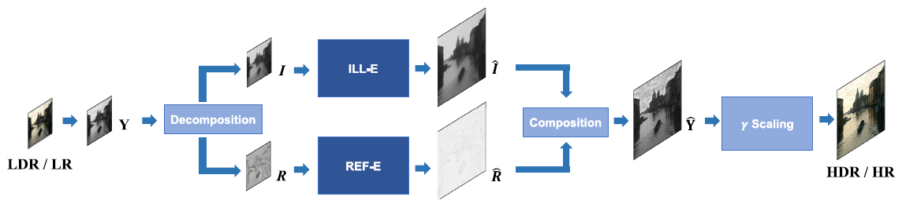
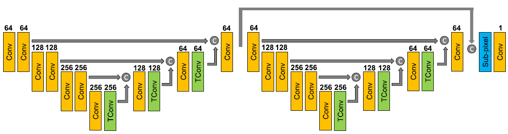
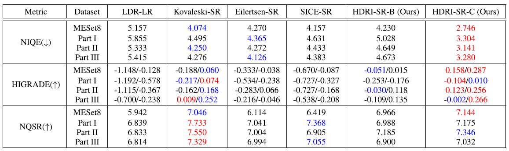
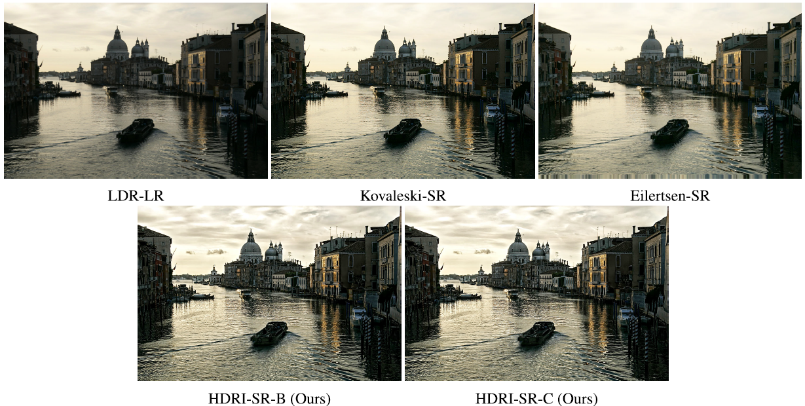
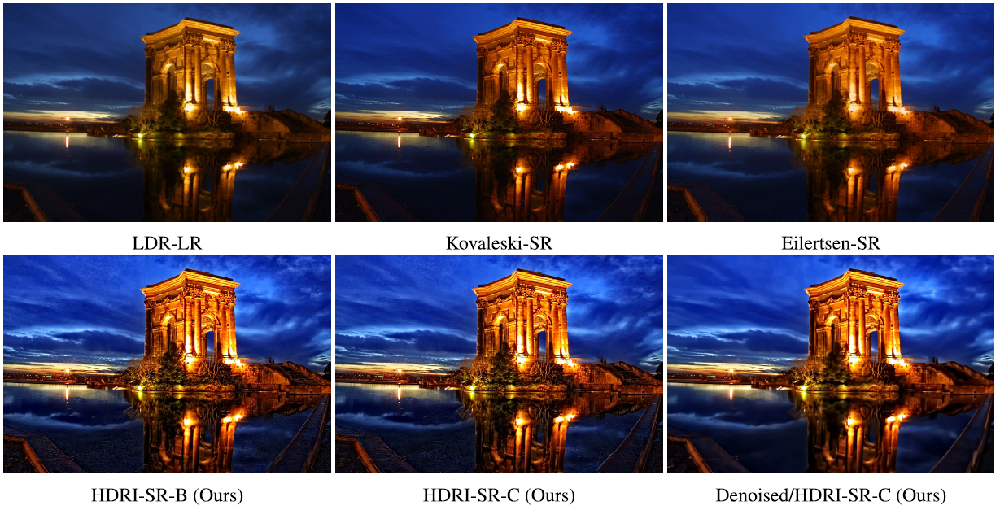
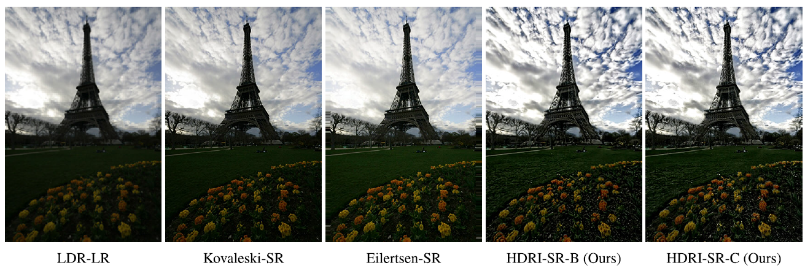

# HDRI-SR

# [Joint High Dynamic Range Imaging and Super-Resolution from a Single Image](https://ieeexplore.ieee.org/abstract/document/8924704)

Jae Woong Soh, Jae Sung Park, and Nam Ik Cho

[[Paper]](https://ieeexplore.ieee.org/stamp/stamp.jsp?tp=&arnumber=8924704&tag=1) [[Arxiv]](https://arxiv.org/abs/1905.00933)
## Environments
- Ubuntu 18.04
- [Tensorflow 1.8](http://www.tensorflow.org/)
- CUDA 9.0 & cuDNN 7.1
- Python 3.6
- MATLAB

## Abstract

This paper presents a new framework for jointly enhancing the resolution and the dynamic range of an image, i.e., simultaneous super-resolution (SR) and high dynamic range imaging (HDRI), based on a convolutional neural network (CNN). From the common trends of both tasks, we train a CNN for the joint HDRI and SR by focusing on the reconstruction of high-frequency details. Specifically, the high-frequency component in our work is the reflectance component according to the Retinex-based image decomposition, and only the reflectance component is manipulated by the CNN while another component (illumination) is processed in a conventional way. In training the CNN, we devise an appropriate loss function that contributes to the naturalness quality of resulting images. Experiments show that our algorithm outperforms the cascade implementation of CNN-based SR and HDRI.
<br><br>

## Brief Description of Our Proposed Method

### <u>Overall Process of the Proposed Scheme</u>

<p align="center"></p>

LDR-LR input is first decomposed into the illumination and the reflectance components. ILL-E and REF-E enhance each of components respectively and finally merged together to generate an HDR-SR image.

### <u>Image Decomposition</u>

<p align="center"></p>

WLS filtering based decomposition is first applied. The figure shows the luminance, estimated illumination, and reflectance components.

### <u>Network Architecture</u>

<p align="center"></p>

For REF-E, we adopt the convolutional neural network (CNN), specifically, stacked hourglass structure.

## Experimental Results

**Quantitative results on the test set (NR-IQAs)**

<p align="center"></p>

## Visualized Results

<p align="center"></p>
<br>
<p align="center"></p>
<br>
<p align="center"></p>

## Guidelines for Codes

**Requisites should be installed beforehand.**

Clone this repo.

```
git clone http://github.com/JWSoh/HDRI-SR.git
cd HDRI-SR/
```

### Test

0. Ready for input data (low (standard) dynamic range, low-resolution).

1. Decompose your input data to obtain reflectance components.

Run below MATLAB code.
```
Decompose_Test.m
```

2. Pass REF-E (reflectance enhancement).

Run below Python code. Require Tensorflow to run CNN on GPU.
```
python test_real.py --gpu [GPU_number] --datapath [Input data path] --modelpath [Model_B/Model_C]

--gpu: The number designates the index of GPU which is going to be used. [Default: 0]
--datapath: Path of input reflectances [Default: LR_mat(x2)]
--modelpath: Which model to use? Model_B or Model_C? [Default: Model_B]
```

3. Recombine or Synthesize to get HDR-SR image.

Run below MATLAB code.
```
Synthesize_test
```

4. To visualize the results on your LDR monitor, you need a tone-mapping algorithm.

There are lots of tone-mapping algorithms, you can download some of them from google, or simply use representative algorithms from MATLAB HDR toolbox.


## Citation
```
@article{soh2019joint,
  title={Joint High Dynamic Range Imaging and Super-Resolution From a Single Image},
  author={Soh, Jae Woong and Park, Jae Sung and Cho, Nam Ik},
  journal={IEEE Access},
  volume={7},
  pages={177427--177437},
  year={2019},
  publisher={IEEE}
}
```